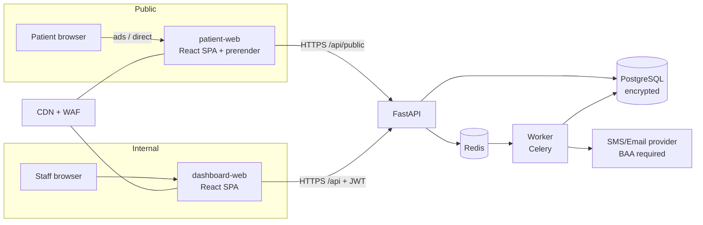
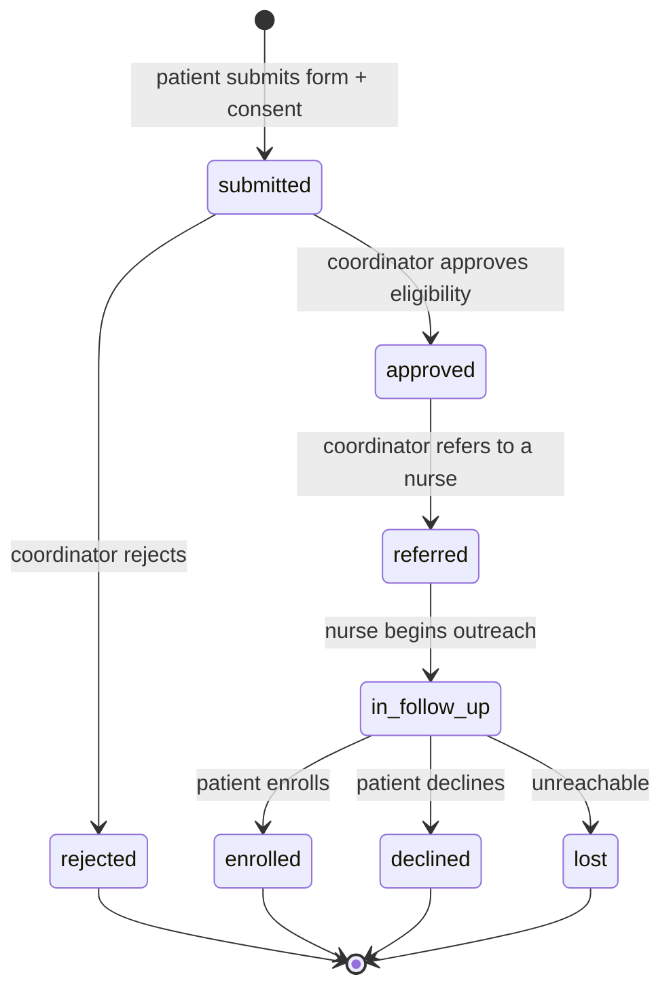
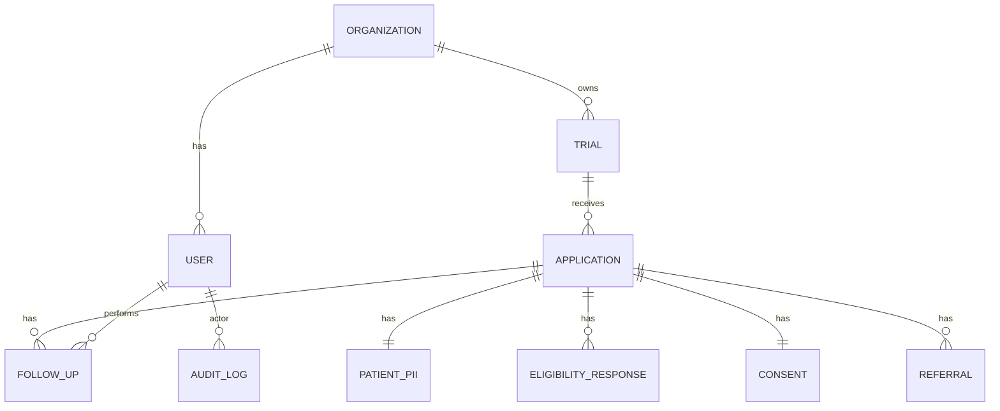

# Architecture — CRP-Pro

> Production architecture for a clinical-trial patient-recruitment platform.
> Stack: **React (Vite)** frontends · **FastAPI** backend · **PostgreSQL**.
> Replace `CRP-Pro` with the real product name. `TODO:` marks decisions for you.

---

## 1. What it is & design goals

A multi-tenant platform that lets hospitals/research sites recruit patients into
clinical trials. The public funnel converts ad traffic into screened, consented
leads; internal staff (Coordinator → Nurse, overseen by Admin) move each lead from
submission to enrollment.

Design goals, in priority order:

1. **Protect PHI.** Privacy/consent/audit are architectural invariants, not features.
2. **Multi-tenant isolation.** One site can never see another site's patients.
3. **Public surface stays minimal.** The patient app holds no PHI of others and ships no staff/auth code.
4. **Auditable workflow.** Every state change and PHI access is traceable to an actor.
5. **Operability.** Async, queued outreach; horizontal scale on the API.

---

## 2. Actors

| Actor | Auth | Scope |
|---|---|---|
| **Patient** | None (public) | Own submission only; never logs in |
| **Coordinator** | Authenticated | Their org's new leads; approve & refer to Nurse |
| **Nurse** | Authenticated | Patients referred to them; follow-up; create trials |
| **Admin** | Authenticated | Their org: oversee both dashboards, manage users, create trials |

> **Cross-org access does not exist for any role.** Admin is org-scoped, not global.
> A platform "super-admin" (your company) is a separate concern — see §10.

---

## 3. High-level topology



- **patient-web** and **dashboard-web** are separate React builds. The patient app
  never imports auth, RBAC, or other patients' data — it only talks to `/api/public/*`.
- All staff traffic carries a short-lived JWT and hits org-scoped, RBAC-gated routes.
- Outreach (SMS/email) is enqueued to Redis and sent by the worker, never inline.

---

## 4. Application lifecycle (state machine)

The whole product is one entity — the **application** (a.k.a. lead) — moving through states.



Every transition writes an audit record (actor, from→to, timestamp).

---

## 5. Components

### 5.1 `patient-web` (public React SPA)
- Routes: trial list, trial detail, application form (basic info → eligibility questionnaire → consent → submit).
- No login, no PHI of others, no staff bundle.
- Trial pages need fast load + correct social/meta tags (traffic is paid ads) → **prerender/SSG the trial pages** at build or via a lightweight prerender service. SEO is secondary to load speed and shareability. `TODO: confirm prerender approach`.
- Anti-abuse on submit: CAPTCHA + server-side rate limiting (public write endpoint).

### 5.2 `dashboard-web` (internal React SPA)
- **Single shared login page** — one route (`/login`) for all staff roles. After authentication, the account's role (from the DB) determines which dashboard the user lands on. The page is a UI/UX choice, **not** the security boundary — see §9.
- Routes gated by role; the UI hides what the API also forbids (defense in depth, but the API is the source of truth).
- Coordinator: lead inbox (list) → click a patient → **detail drawer reveals actions** (approve, reject, refer, SMS/contact). Actions hidden until a patient is selected.
- Nurse: referred-patient queue → follow-up logging (call/SMS/email) → trial creation.
- Admin: org overview, user management (create/disable Coordinator & Nurse), trial creation, oversight views.

### 5.3 `api` (FastAPI)
Layered: **router → service → repository → model**.
- Routers: thin, do validation + auth + call services.
- Services: business rules, state-machine transitions, authorization decisions.
- Repositories: all DB access; the only layer that touches SQLAlchemy.
- Cross-cutting: auth dependency, **org-scope dependency**, audit decorator, rate limiter.

### 5.4 Worker (Celery + Redis)
- Sends SMS/email, processes notifications, server-side ad conversion events.
- Idempotent tasks; retries with backoff; dead-letter for failures.

### 5.5 PostgreSQL
- Single primary + read replica (later). Encryption at rest. Automated encrypted backups + PITR.
- Most-sensitive columns additionally encrypted at the application layer (see §9).

---

## 6. Roles & permissions (RBAC matrix)

All rows are **implicitly scoped to the actor's `org_id`.**

| Capability | Coordinator | Nurse | Admin |
|---|:--:|:--:|:--:|
| View new/submitted leads | ✅ | — | ✅ (oversight) |
| Approve / reject eligibility | ✅ | — | ✅ |
| Refer approved lead to a Nurse | ✅ | — | ✅ |
| View referred patients | own refs | assigned | ✅ |
| Log follow-up (call/SMS/email) | ✅ | ✅ | ✅ |
| Create / launch trial | — | ✅ | ✅ |
| Manage users (create/disable) | — | — | ✅ |
| Oversee both dashboards | — | — | ✅ |

> **Compliance note on Admin oversight:** "view both dashboards" is implemented as
> read access to org data, but apply **minimum-necessary** — log every Admin view of
> patient PHI to the audit trail, and consider an overview/metrics view that avoids
> exposing individual PHI unless explicitly drilled into. `TODO: confirm how much PHI Admin should see by default.`

Authorization is **default-deny**, enforced **server-side per query** (org filter +
role check), never by hiding buttons alone.

---

## 7. Data model



Key tables (PHI-bearing tables flagged):

- **organization** — tenant root. `id, name, status`.
- **user** — `id, org_id, role(enum: coordinator|nurse|admin), email, password_hash, mfa_enabled, status`.
- **trial** — `id, org_id, title, description, status, locations, eligibility_schema (JSONB), irb_protocol, created_by`. The questionnaire is **data-driven JSONB**, not hardcoded.
- **application** *(lead)* — `id, trial_id, org_id (denormalized for scoping), status(enum, see §4), assigned_nurse_id, submitted_at`.
- **patient_pii** ⚠️PHI — `application_id, name(enc), phone(enc), email(enc)`. Separated so PHI can be encrypted/retention-managed independently.
- **eligibility_response** ⚠️PHI — `application_id, question_key, answer`. Treat answers as PHI.
- **consent** ⚠️PHI/legal — `application_id, version, text, ip, user_agent, created_at`. **Immutable.**
- **referral** — `application_id, from_user_id, to_nurse_id, created_at`.
- **follow_up** ⚠️PHI — `application_id, user_id, channel(call|sms|email), outcome, notes, created_at`.
- **message** — outbound SMS/email log (store delivery metadata; keep PHI minimal).
- **audit_log** ⚠️append-only — `id, actor_user_id, action, entity, entity_id, ip, created_at`.

`org_id` is denormalized onto `application` so every scoped query filters by it directly.

---

## 8. Representative API surface

```
# Public (no auth, rate-limited, CAPTCHA on writes)
GET  /api/public/trials                      # active trials
GET  /api/public/trials/{id}
POST /api/public/trials/{id}/applications     # {pii, eligibility_answers, consent}

# Auth
POST /api/auth/login            # email + password (+ MFA). Role comes from the account in the DB;
                                # the session reflects that role. Bad creds → generic "invalid credentials"
POST /api/auth/refresh
POST /api/auth/logout

# Coordinator
GET  /api/applications?status=submitted       # org-scoped list
GET  /api/applications/{id}                    # logs PHI access
POST /api/applications/{id}/approve
POST /api/applications/{id}/reject
POST /api/applications/{id}/refer              # {nurse_id}
POST /api/applications/{id}/messages           # enqueue SMS/contact

# Nurse
GET  /api/applications?assigned=me
POST /api/applications/{id}/follow-ups         # {channel, outcome, notes}
POST /api/trials

# Admin
POST /api/users                                # create coordinator/nurse
PATCH /api/users/{id}                          # disable, change role
GET  /api/overview                             # org dashboard metrics
POST /api/trials
```

Every authenticated route runs through: authenticate → resolve `org_id` → authorize
(role + ownership) → handle → audit (for PHI reads/writes).

---

## 9. Security & compliance architecture (the core)

This product handles **PHI**. The following are invariants:

- **PHI definition:** patient name, phone, email, IP-linked identity, **and all
  eligibility answers and follow-up notes.**
- **Encryption:** TLS in transit; Postgres encryption at rest; **application-layer
  encryption** on the most sensitive columns (`patient_pii`, eligibility answers) so a
  DB dump alone doesn't expose them. `TODO: KMS/envelope-encryption provider.`
- **No PHI in logs / metrics / error trackers / analytics.** Structured logging with a
  redaction filter; verify Sentry/etc. scrub before sending.
- **Audit everything PHI:** read, write, export — actor, action, entity, timestamp, IP.
  `audit_log` is append-only; no app code may update/delete it.
- **Consent before contact:** the public submit captures versioned, timestamped consent
  with IP; without it the submission is rejected. Consent rows are immutable.
- **RBAC + org isolation:** default-deny, server-side, per-query org filter. Tests must
  cover cross-org access attempts (must fail).
- **Auth hardening:** short-lived access tokens + rotating refresh; **MFA for staff**;
  lockout/rate-limit on login; password hashing with a modern KDF (argon2/bcrypt).
- **Single shared login (the page is not the boundary):** one login page for all staff
  roles. The page does **not** grant role — the account's role in the DB does, verified
  server-side on every request, and it decides which dashboard the user lands on. Bad
  credentials are **rejected** with a **generic "invalid credentials"** message (never
  reveal whether the account exists or its role — prevents enumeration).
- **Public endpoint protection:** WAF, rate limiting, CAPTCHA on the application POST.
- **Vendor BAAs:** every service touching PHI (hosting, managed DB, SMS/email,
  error tracking) must have a signed Business Associate Agreement. SMS/email providers
  with BAAs exist (e.g. Twilio, Paubox) — `TODO: confirm chosen providers`.
- **Ad rules:** social platforms forbid targeting by medical condition. Targeting is
  contextual; the landing-page pre-screener qualifies. Ad creative must be IRB-approved.
  Conversion tracking is **server-side** with hashed identifiers (no client pixels carrying health context).

---

## 10. Multi-tenancy

- Tenant = **organization** (hospital/site). Every user, trial, and application carries `org_id`.
- Isolation enforced in the repository layer via a mandatory org filter; consider
  Postgres **row-level security** as a second guardrail.
- **Platform operator (your company)** is *not* an org Admin. If you need internal
  back-office access, build a separate, heavily-audited super-admin surface — do not
  overload the org Admin role. `TODO: decide if/when this is needed.`

---

## 11. Background processing & notifications

- Redis-backed Celery workers handle SMS/email send, retries, and ad-conversion events.
- Tasks are idempotent and carry the minimum PHI necessary (prefer "you have a new
  lead, open the app" over putting patient details in a notification).
- A scheduler (Celery beat) can drive reminders / stale-lead nudges later.

---

## 12. Deployment & infrastructure

- **Containers** (Docker) for `api` and `worker`; static frontends built and served via **CDN + WAF**.
- **HIPAA-eligible cloud** with a signed BAA. Managed **Postgres** (encryption, automated
  encrypted backups, PITR), managed **Redis**. `TODO: pick cloud (AWS/GCP/Azure).`
- Network: API and DB in private subnets; DB never publicly reachable; secrets in a
  managed secret store (no secrets in env files committed to git).
- **CI/CD:** lint + typecheck + tests + security scan gate every deploy; migrations run
  as a controlled step.
- **Environments:** dev / staging / prod. **Real PHI only in prod**; lower envs use
  synthetic data.

---

## 13. Observability

- Structured, PHI-redacted logs; request IDs; correlation across api↔worker.
- Metrics: funnel (views → submitted → approved → referred → enrolled), queue depth,
  API latency/error rate.
- Tracing on API and worker. Alerting on error spikes and queue backlog.

---

## 14. Tech stack summary

| Layer | Choice |
|---|---|
| Public frontend | React + Vite (`patient-web`), prerendered trial pages |
| Internal frontend | React + Vite (`dashboard-web`), TanStack Query, React Router |
| Backend | FastAPI, Pydantic v2, async SQLAlchemy 2.0, Alembic |
| DB | PostgreSQL (encrypted, RLS optional) |
| Cache/queue | Redis + Celery |
| Auth | OAuth2 JWT (access+refresh), MFA for staff |
| Comms | SMS/email provider **with BAA** |
| Infra | Docker, HIPAA-eligible cloud + BAA, CDN + WAF |
| Tests | pytest + httpx (API), Vitest + Playwright (web) |

---

## 15. Build order (MVP → later)

**MVP**
1. Org + user + auth (roles, MFA scaffolding).
2. Trial model + data-driven eligibility schema; trial create (Nurse/Admin).
3. Public: trial list, trial detail, application form (pii + eligibility + consent), submit.
4. Coordinator: lead inbox → detail drawer → approve/reject → refer to Nurse.
5. Nurse: referred queue → follow-up logging → enqueue SMS/email.
6. Admin: user management + org overview.
7. Audit logging + PHI encryption + RBAC tests **from the start, not last.**

**Later**
- Direct Meta/Google Ads API campaigns + server-side conversion tracking.
- Platform super-admin / cross-org back office.
- Two-way SMS, scheduling, EHR/CTMS integration, multi-language pre-screeners, analytics for sponsors.
